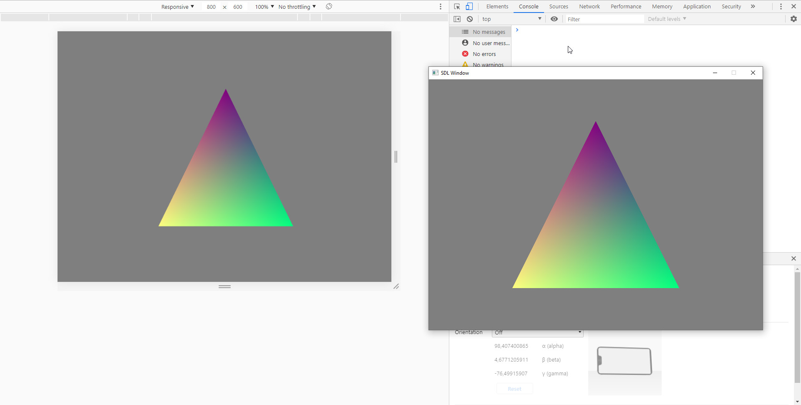

# wasm-webgl
A cross-platform D application that can be compiled both to machine code or wasm. It renders graphics using OpenGL 3.3 or WebGL 2 and includes a tiny `betterC` runtime.

**Warning: highly experimental!**

## Usage
By default this project targets desktop platforms. To compile WebAssembly do the following:
1. Install latest LDC, Node.js, Rollup
2. Build wasm module:
   `dub build --config=web --build=release --compiler=ldc2`
3. Run:
   `npm run bundle`

Or you can just run the bundle in `dist` folder using your preferred web server for a quick test.